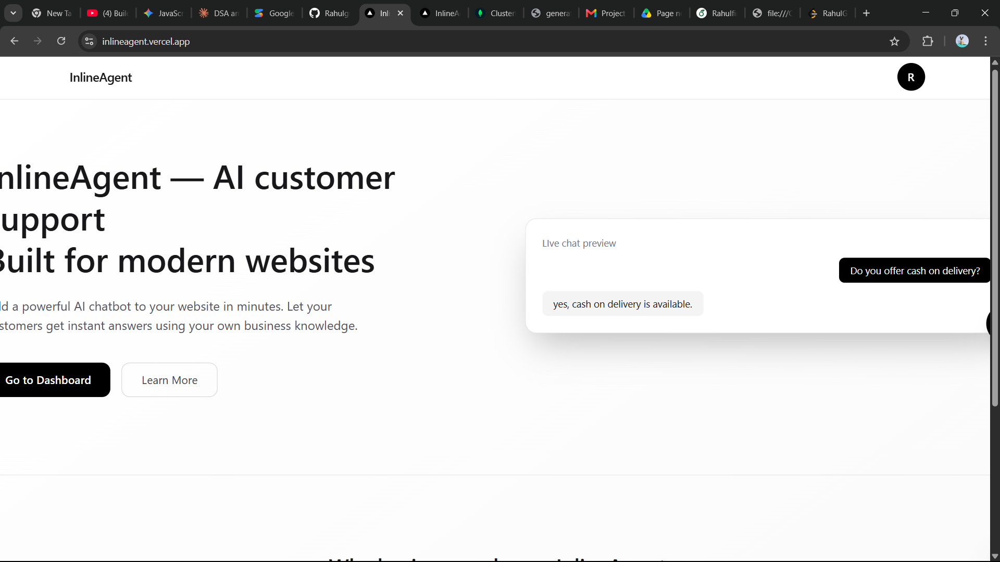
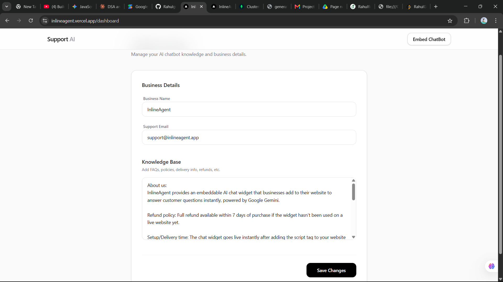
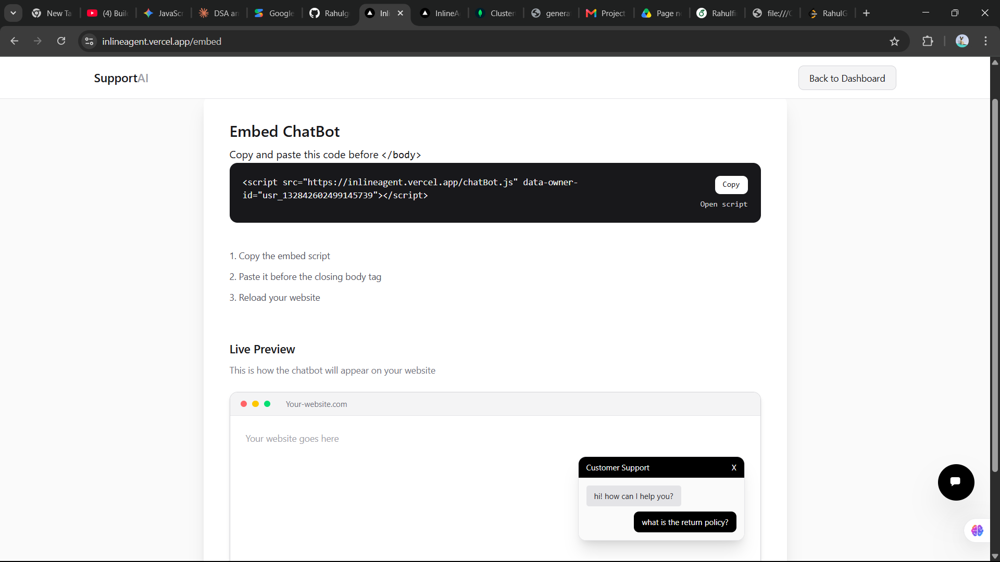
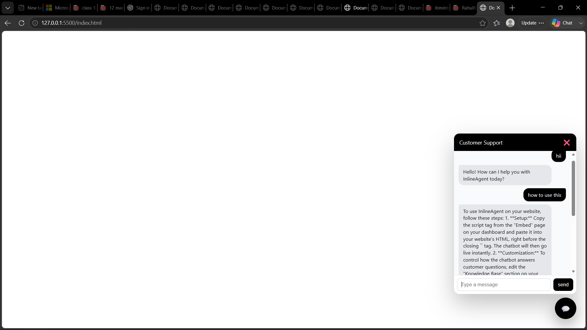

<div align="center">

# 🤖 InlineAgent

**A lightweight, embeddable AI customer support chatbot for any website**

[](https://inlineagent.vercel.app/)
[](https://nextjs.org/)
[](https://www.typescriptlang.org/)
[](https://www.mongodb.com/)
[](LICENSE)

[Live Demo](https://inlineagent.vercel.app/) · [Report Bug](https://github.com/Rahulgupta62090/AI-customer-support/issues) · [Request Feature](https://github.com/Rahulgupta62090/AI-customer-support/issues)

</div>

---

## 📖 About

**InlineAgent** is a plug-and-play AI customer support widget built with **Next.js** and **TypeScript**. Drop a single script tag into any website and get a fully functional AI chatbot backed by an admin dashboard for managing content, settings, and user sessions.

This repo contains both the **admin web app** and the **embeddable client script**.

## ✨ Features

- 🔌 **Plug & play embed script** — add a chat widget to any site with one `<script>` tag
- 🛠️ **Admin dashboard** — manage content, settings, and user sessions
- 🗄️ **MongoDB-backed storage** — persistent settings and session data
- 🔗 **Scalable integrations** — ScaleKit auth, Gemini / other GenAI providers
- ⚡ **Built on Next.js App Router** — fast, modern, and easy to deploy

## 🖥️ Tech Stack

| Layer | Technology |
|---|---|
| Framework | Next.js (App Router) |
| Language | TypeScript |
| Database | MongoDB |
| Auth / Integrations | ScaleKit |
| AI Provider | Gemini (GenAI) |
| Deployment | Vercel |

## 📸 Screenshots

**Landing Page**


**Admin Dashboard — Manage Knowledge Base & Business Details**


**Embed Page — Get Your Script Tag**


**Live Chat Widget**


## 📂 Project Structure

```
├── app/                     # Next.js app router source
│   ├── components/          # React components (admin UI)
│   ├── embed/page.tsx       # Embeddable client page
│   └── lib/db.ts            # MongoDB connection helper
├── public/
│   └── chatBot.js           # Embed script served to client sites
└── ...
```

## 🚀 Quick Start (Local Development)

### 1. Clone & install dependencies
```bash
git clone https://github.com/Rahulgupta62090/AI-customer-support.git
cd AI-customer-support
npm install
```

### 2. Set up environment variables
Create a `.env.local` file in the project root (see [Environment Variables](#-environment-variables) below).

### 3. Run the dev server
```bash
npm run dev
```

### 4. Build for production
```bash
npm run build
npm run start
```

## 🔑 Environment Variables

| Variable | Required | Description |
|---|---|---|
| `NEXT_PUBLIC_APP_URL` | ✅ | Public URL where the app is hosted (used by the embed script) |
| `MONGODB_URL` | ✅ | MongoDB connection string |
| `SCALEKIT_ENVIRONMENT_URL` | ⬜ | ScaleKit environment URL (if using ScaleKit) |
| `SCALEKIT_CLIENT_ID` | ⬜ | ScaleKit client ID |
| `SCALEKIT_CLIENT_SECRET` | ⬜ | ScaleKit client secret |
| `GEMINI_API_KEY` | ⬜ | API key for Gemini / other GenAI provider |

> ⚠️ **Never commit secrets to source control.** Rotate and manage keys via your provider dashboards.

## 🧩 Embedding the Widget

Add this script tag to any website to load the chat widget:

```html
<script src="https://inlineagent.vercel.app/chatBot.js" async></script>
```

Or, if self-hosting:
```html
<script src="${NEXT_PUBLIC_APP_URL}/chatBot.js" async></script>
```

## 🧪 Linting

```bash
npm run lint
```

## ☁️ Deployment

This project is deployed on **Vercel**.

1. Set all required environment variables in the Vercel dashboard
2. Deploy the project root (or the appropriate subfolder if using a monorepo layout)
3. Update OAuth / ScaleKit redirect URLs to match your production domain

> **Note:** `package-lock.json` may need regeneration after a fresh `npm install` — do this locally or in CI.

## 🤝 Contributing

Contributions are welcome! Please open an issue first to discuss what you'd like to change.

1. Fork the repo
2. Create your branch (`git checkout -b feature/amazing-feature`)
3. Commit your changes (`git commit -m 'Add amazing feature'`)
4. Push to the branch (`git push origin feature/amazing-feature`)
5. Open a Pull Request

## 📄 License

Distributed under the **MIT License**.

## 👤 Author

**Rahul Gupta**
[GitHub](https://github.com/Rahulgupta62090) · [Live Project](https://inlineagent.vercel.app/)
